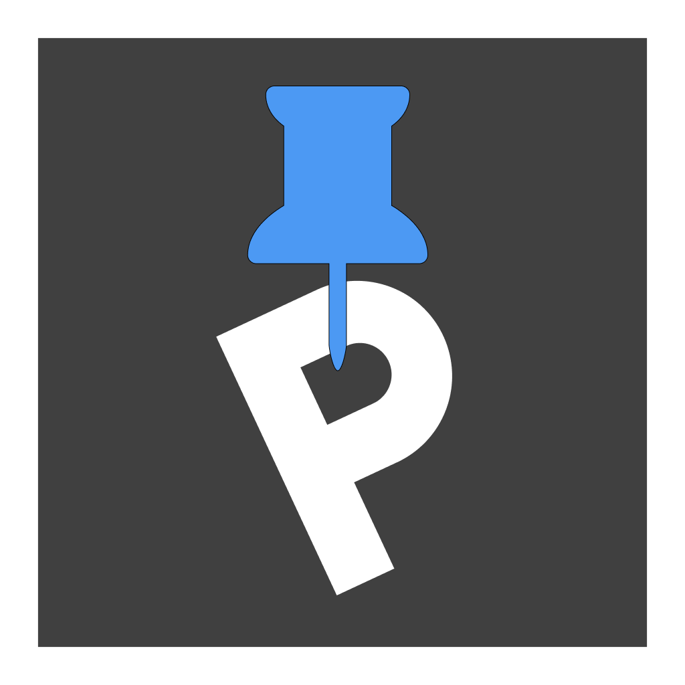

# 거주자 우선 주차 관리 앱, PICKINGPARKING 🚗

  

## 📅 프로젝트 정보

### SSAFY 11기 2학기 자율 프로젝트

2024.10.14(월) ~ 2024.11.19(화) [5주]

 

## 주제

유동 인구가 많은 지역에서의 주차가 힘든 시민들을 위한 **거주자 우선 주차 공유 플랫폼**

 

## 기획 배경

> 서울시의 주차난 증가!

- 서울시 평균 주차장 확보율 : 106.9%
- 2023년 서울시 불법 주·정차 민원 : 148만 3433건

> 타사 앱의 부족한 점

- 주차장 정보 부족
- 결제 정보 설명 부족

 

## 📝 기능 소개

> 거주자 우선 주차 구역 조회

> 주차 예약 및 현장 결제 지원

> OCR을 통한 차량 번호 판별

> 나의 거주자 우선 주차 등록
